# EduStream


Plataforma de streaming de cursos em vídeo, no estilo Netflix/Masterclass — instrutores publicam cursos organizados em módulos e aulas, alunos se matriculam, assistem no seu ritmo e recebem um certificado com validação pública ao concluir.

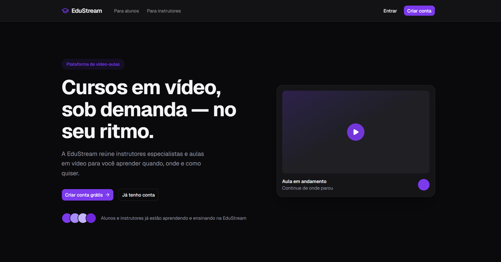

## Sumário
- [O que a plataforma faz](#o-que-a-plataforma-faz)
- [Capturas de tela](#capturas-de-tela)
- [Como o projeto é organizado](#como-o-projeto-é-organizado)
- [Uso de IA neste projeto](#uso-de-ia-neste-projeto)
- [Competências técnicas demonstradas](#competências-técnicas-demonstradas)
- [Licença](#licença)

## O que a plataforma faz

**Para o aluno**
- Catálogo de cursos, com matrícula em um clique
- Currículo do curso (módulos → aulas) com acompanhamento de progresso
- Player de aula com embed do YouTube
- Certificado emitido automaticamente ao concluir 100% do curso, com página pública de validação por hash

**Para o instrutor**
- Dashboard com métricas e gráfico de alunos matriculados por curso
- Cadastro e gerenciamento completo de cursos, módulos e aulas
- Pré-visualização automática da thumbnail do vídeo ao colar a URL, antes de salvar a aula
- Visão dos alunos matriculados em cada curso, com progresso individual

## Capturas de tela

### Jornada do aluno

| Catálogo | Currículo do curso |
|---|---|
| 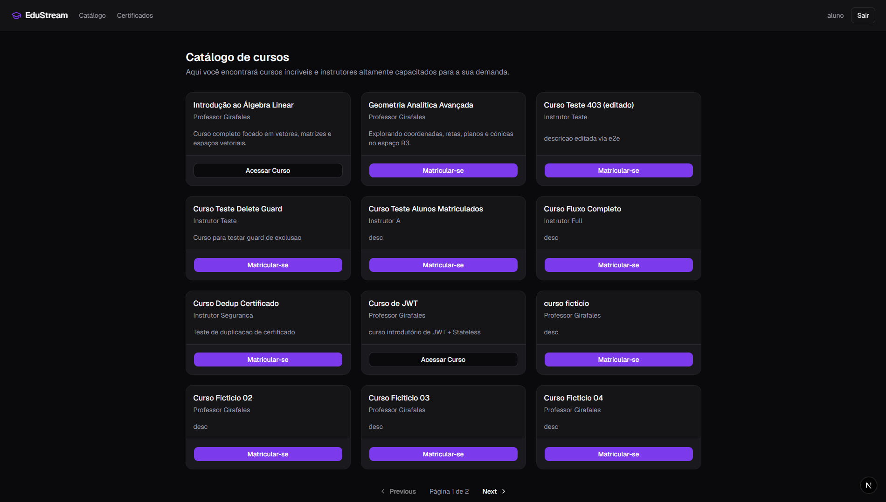 | 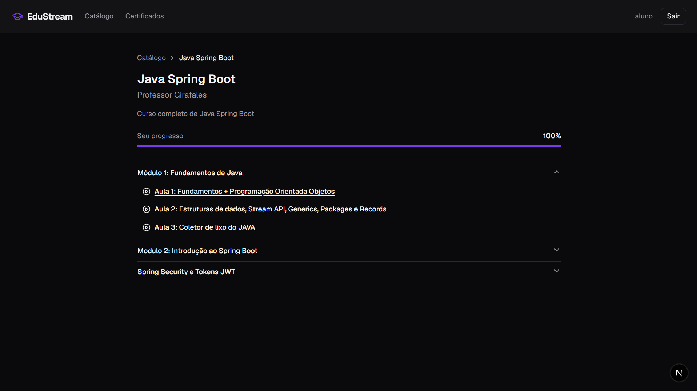 |

| Player de aula | Certificados |
|---|---|
| 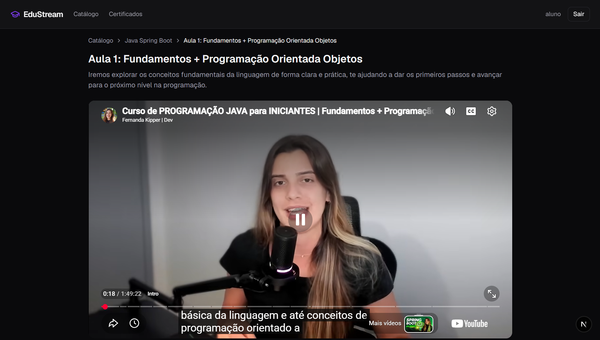 | 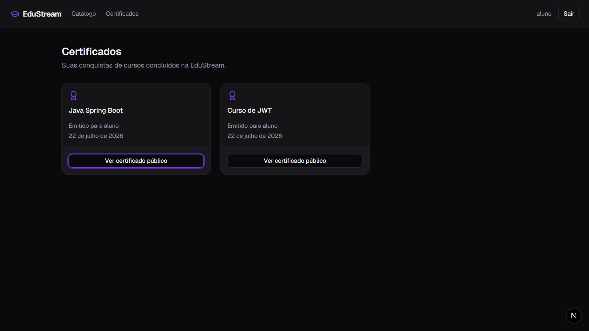 |

**Validação pública do certificado** (não precisa estar logado — qualquer pessoa com o link pode conferir):

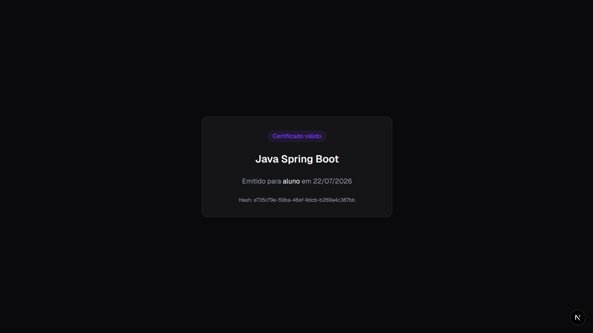

### Jornada do instrutor

**Dashboard**, com gráfico de alunos matriculados por curso:

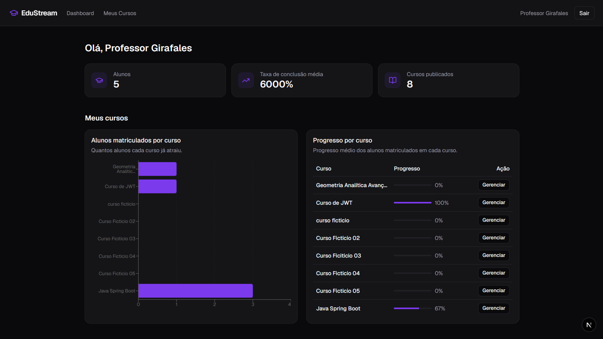

| Meus cursos | Detalhe do curso (alunos matriculados) |
|---|---|
| 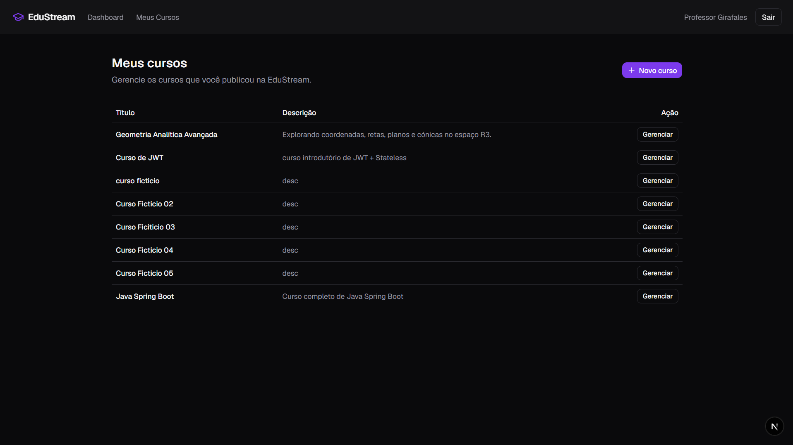 | 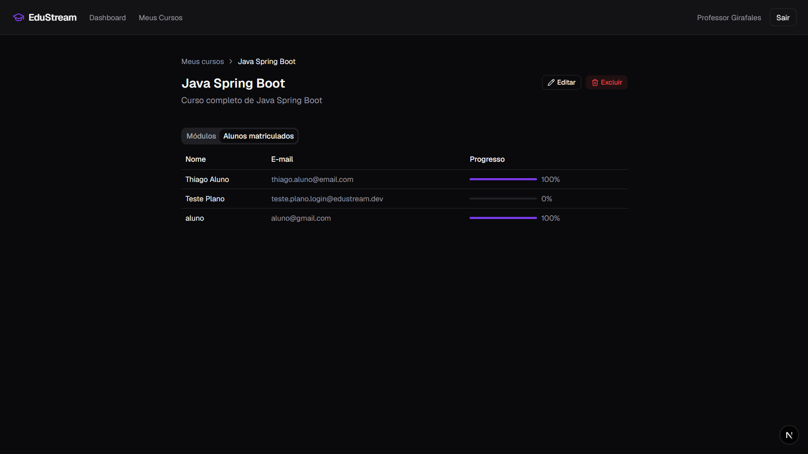 |

**Preview automático da thumbnail do YouTube** ao cadastrar uma aula, pra confirmar que o vídeo certo foi encontrado antes de salvar:

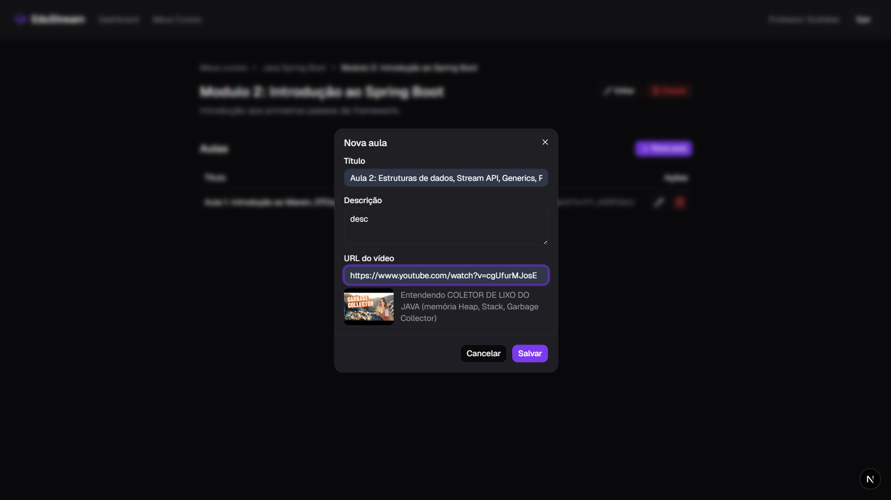

### Autenticação

| Login | Cadastro |
|---|---|
| 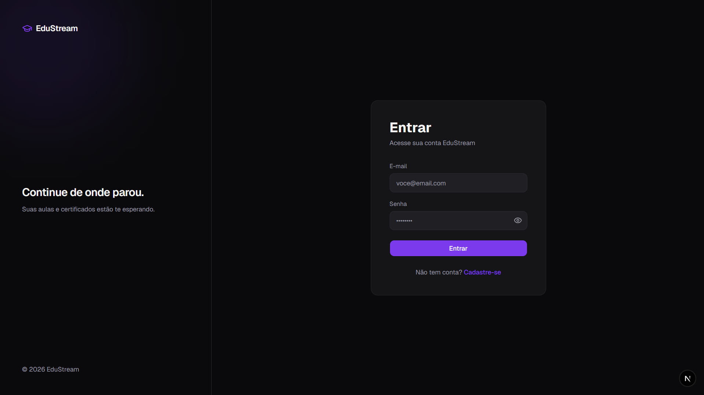 | 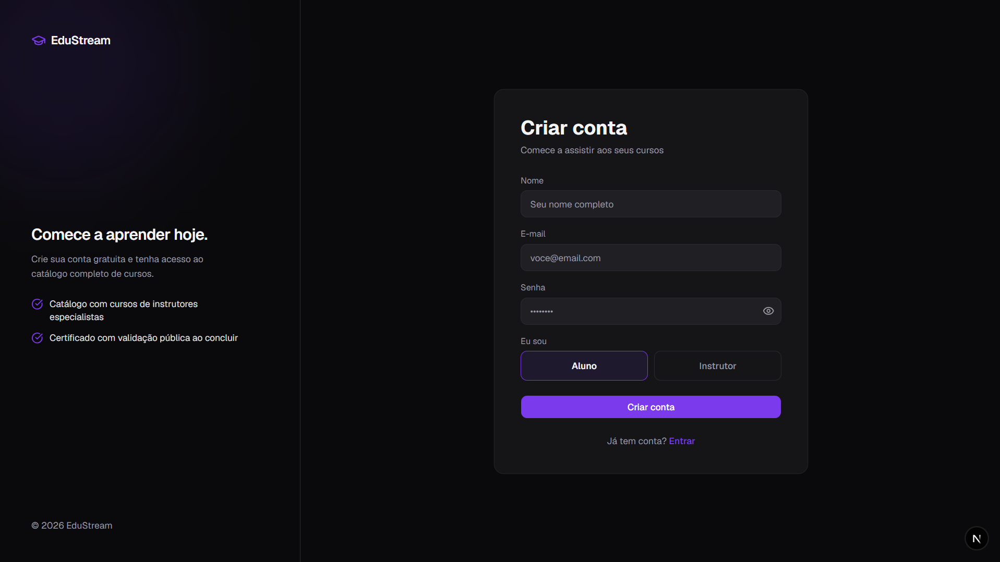 |

## Como o projeto é organizado

O sistema é dividido em duas partes que conversam por API: um backend que guarda os dados e as regras (quem pode fazer o quê), e um frontend que é a tela que o usuário usa.

```
frontend (Next.js, porta 3000)  ──▶  backend (Spring Boot, porta 8080)  ──▶  banco de dados PostgreSQL
```

| Parte | Tecnologias |
|---|---|
| Backend | Java 17, Spring Boot 4, Spring Security, PostgreSQL |
| Frontend | Next.js 16, TypeScript, Tailwind CSS, shadcn/ui |

Duas decisões que valem explicar:
- O login não usa "sessão" guardada no servidor — ele gera um token que o navegador guarda e reenvia a cada ação, provando quem é o usuário sem o servidor precisar lembrar de nada.
- O papel do usuário (aluno ou instrutor) é sempre conferido direto no banco a cada ação, nunca só confiando no que veio no token — assim ninguém consegue se passar por outro papel adulterando essa informação.

### Rodando localmente

Pré-requisitos: Java 17+, Node.js 20+ e PostgreSQL rodando na sua máquina.

**Backend**

```bash
cd backend
```

Copie `src/main/resources/application-local.properties.example` para `application-local.properties`, na mesma pasta, e preencha com o usuário/senha do seu Postgres local (qualquer texto longo serve como `jwt.secret` em desenvolvimento).

```bash
./mvnw spring-boot:run -Dspring-boot.run.profiles=local
```

A API sobe em `http://localhost:8080`.

**Frontend**

```bash
cd frontend
cp .env.example .env.local
npm install
npm run dev
```

A aplicação sobe em `http://localhost:3000`.

### Estrutura do repositório

```
backend/    API (controllers, regras de negócio, acesso ao banco)
frontend/   Telas (rotas, componentes, chamadas à API)
snapshots/  Capturas de tela usadas neste README
```

## Uso de IA neste projeto

O backend foi escrito por mim. O frontend foi construído com o Claude Code, para acelerar a entrega — arquitetura, revisão de cada tela e teste do fluxo real ficaram comigo. Depois de pronto, o projeto passou por uma auditoria de segurança e qualidade, também com o Claude Code, que encontrou e corrigiu problemas reais: emissão duplicada de certificado, ausência de validação de entrada na API, uma exceção mal tratada e um bug de cálculo que chegou a exibir "6000%" no dashboard.

## Competências técnicas demonstradas

**Backend**
- Autenticação JWT stateless implementada do zero (`HMAC256`, expiração, verificação de assinatura e issuer) — papéis resolvidos do banco a cada requisição, nunca confiados no conteúdo do token
- RBAC em duas camadas: `@PreAuthorize` por papel **e** checagem de dono do recurso na camada de serviço (um instrutor não edita curso de outro instrutor)
- Modelagem JPA/Hibernate com relacionamentos reais (`Course` → `Module` → `Lesson` → `LessonProgress`) e tratamento explícito dos limites do `CascadeType.ALL` (progresso de aluno não é apagado em cascata — é bloqueado com 409 antes de virar violação de FK crua)
- Bean Validation em todos os DTOs de entrada, com handler centralizado (`@RestControllerAdvice`) traduzindo cada tipo de erro pro status HTTP certo
- Paginação nativa com Spring Data (`Page`/`Pageable`)

**Frontend**
- App Router do Next.js com RBAC aplicado por `layout.tsx` (guarda de rota centralizada, não espalhada por página)
- Gerenciamento de sessão via `useSyncExternalStore` (sincroniza logout entre abas de graça, sem lib externa)
- Consumo de API com debounce e proteção contra race condition — o preview de vídeo (ver captura acima) dispara requisição 500ms após parar de digitar e descarta qualquer resposta que não seja mais a mais recente
- Data visualization com Recharts, dado real agregado no client (não mockado)

**Transversal**
- Mentalidade de segurança: auditoria cobrindo autorização, validação de entrada, CORS, exposição de segredo, dependências desatualizadas
- Capacidade de achar e corrigir bug de produção real (não só "código que compila")

## Licença

Distribuído sob a licença MIT — veja [LICENSE](LICENSE).
